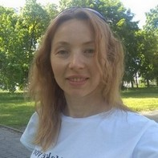

# Katsiaryna Talkachova


## Contacts

* **tel** : +375297938298
* **whatsApp**: +375297938298
* **github**: https://github.com/katrin-brest 

* **e-mail** : katsiaryna.n@gmail.com

## About me:
Now I'm a student of RSSchool JS/FE and my goal is to do my best in studying HTML, CSS and JS and become a true Frontend-developer in near future.

I have no experience of working in IT. I'm an economist and accountant by profession. But I strive to change my life radically and capable of fast learning.

**My strong points:** desire for new knowledge; responsibility; self-reliance; self-organization; constant work at self-improvement; ability to make decisions; command work; non-conflict.

## My skills
 HTML, CSS, JS

## My experience
 RSSchool Stage 0

## My Code
````
function decToBin(d) {
  if (d === 0) {
    return '0';
  }  
  let i = d;
  let bin = '';
  while(i >= 1) {
    bin = `${i % 2}${bin}`;
    i = Math.floor(i / 2);
  }
  return bin;
}
````

## My education
* Master of economics, Brest State Technical University
* Student of RSSchool Stage 0

## My English 
B1 *unconfirmed*